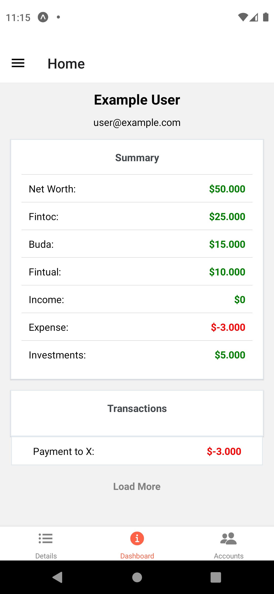

    

<h3 align="center">
  Budget Tracker React
</h3>

  A react frontend for: 
  <a href="https://github.com/aenrione/budget-tracker-rails">budget-tracker-rails api</a>

<h3>
  Preview
</h3>

    

## Dependency

- Requires Node `12.x` engine

## Running local development

#### With expo

1. Install `yarn global add expo-cli`
2. Install dependencies`yarn install`
3. `expo start`

<!-- ## License -->

<!-- - [MIT](LICENSE) -->

